# Project 1: Business Analytics Database Setup

## Overview
This project demonstrates how to design and build a relational database for business analytics. It includes table creation, relationships, and sample data insertion for analysis.

The database includes:
- Employees
- Sales
- Customers

---

## Objective
To create a structured database that can support real-world business analysis such as employee performance, sales trends, and customer insights.

---

## Tools Used
- SQL (Structured Query Language)
- MySQL

---

## Database Structure

### Tables Created:
- employees
- sales (linked to employees via foreign key)
- customers

---

## Files in This Project

- [`create_database.sql`](project_1_database_setup/create_database.sql) → Creates the database
- [`create_tables.sql`](project_1_database_setup/create_tables.sql) → Creates all tables
- [`insert_data.sql`](project_1_database_setup/insert_data.sql) → Inserts sample data

---

## Screenshots

### 1. Database Created
This shows the successful creation of the database.

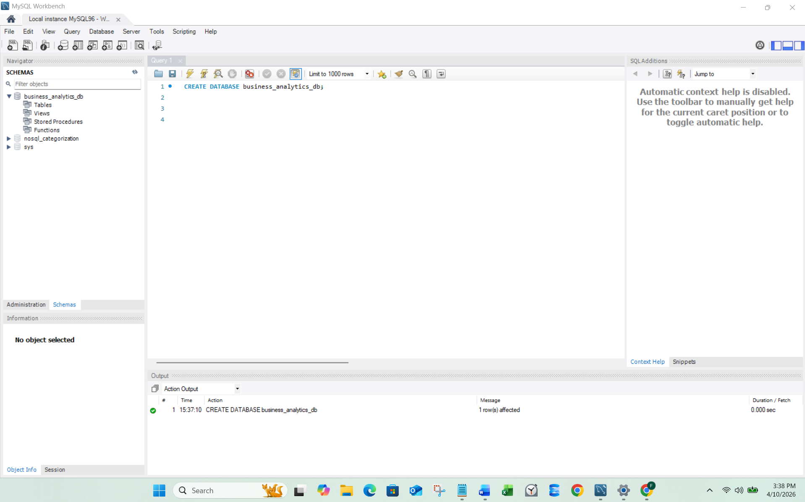

---

### 2. Tables Created
This shows the structure of all tables.

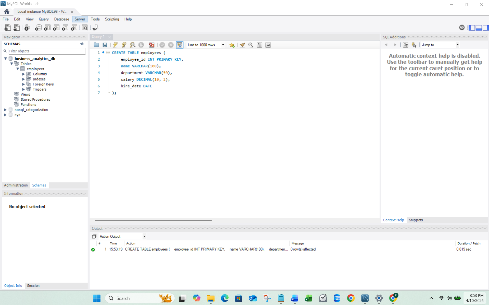
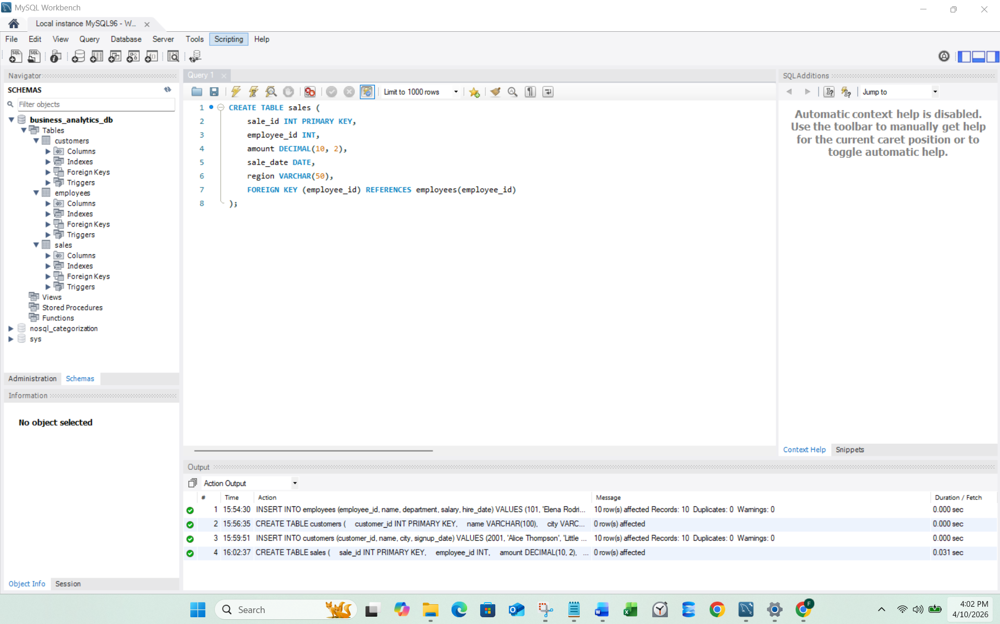
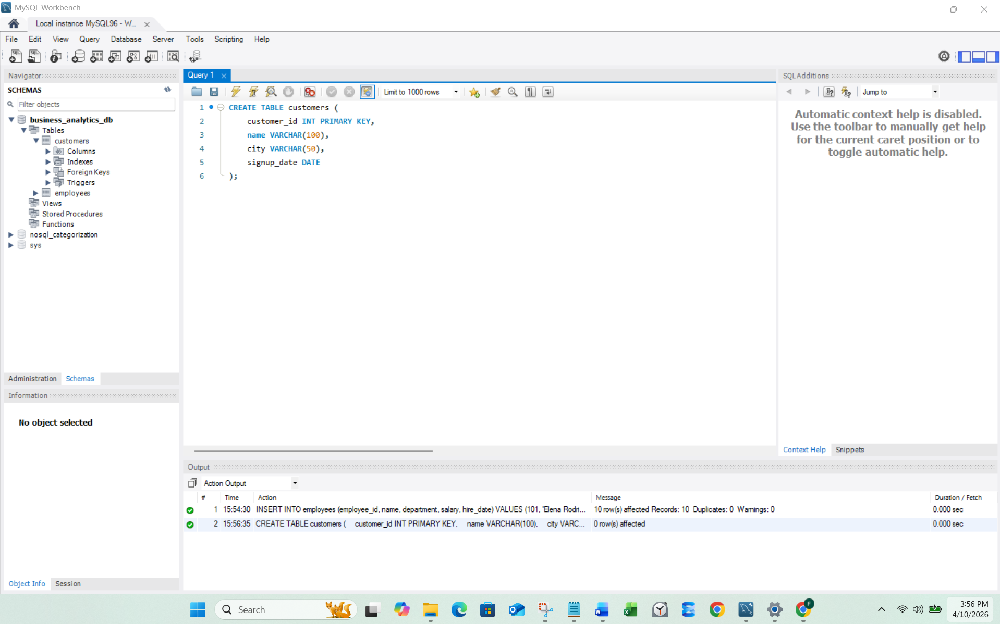

---

### 3. Sample Data Inserted
This shows data inside the employees, customers and sales tables.

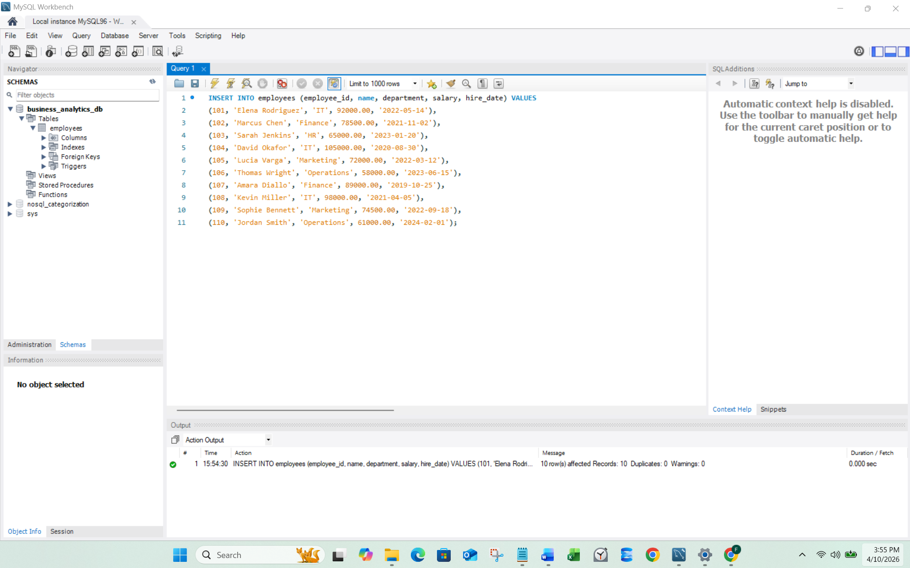
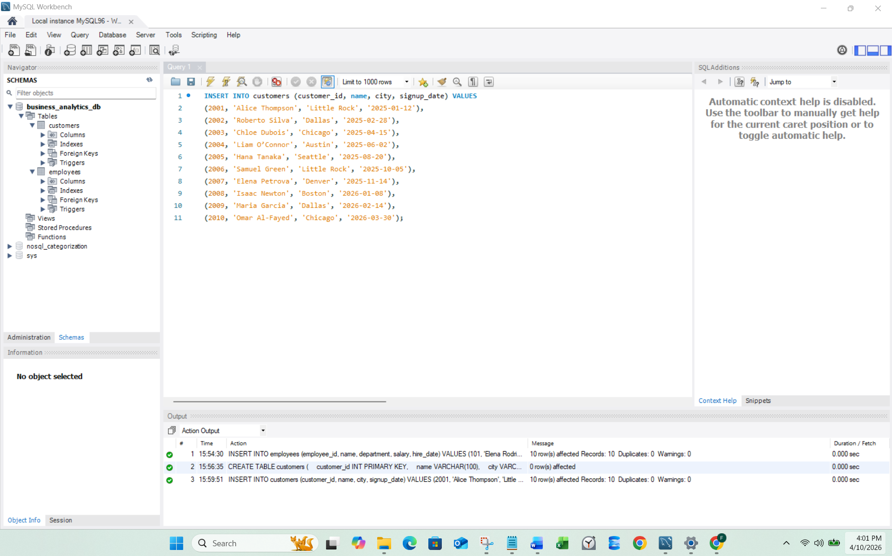
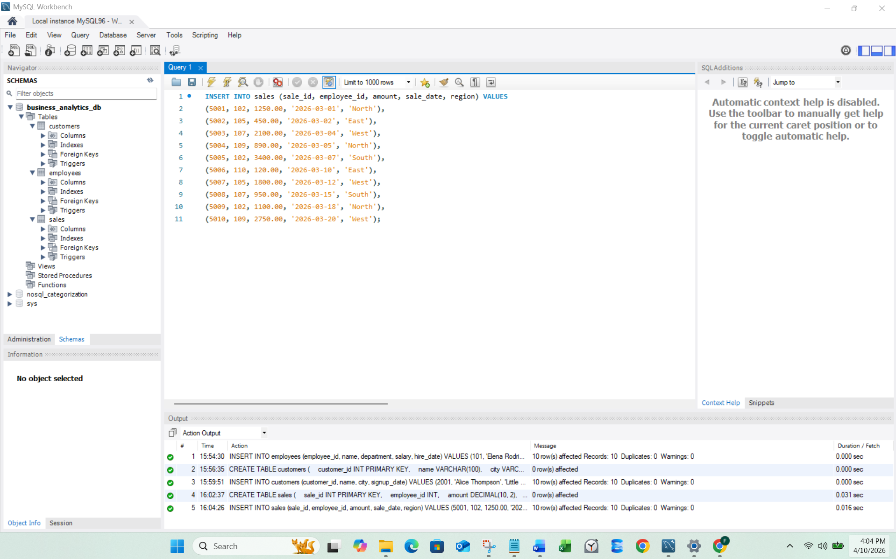

---

## Key Features
- Relational database design
- Primary keys and foreign keys
- Realistic business dataset
- Ready for SQL analysis queries

---

## Outcome
This database is used as the foundation for further projects including:
- Sales analysis
- Employee performance analysis
- Customer behavior analysis

----

# Project 2: Business Sales Analysis

## Overview
This project demonstrates SQL-based business sales analysis using a relational database. It focuses on extracting insights from sales data to understand performance across employees, departments, and regions.

The analysis is built on an existing database structure created in Project 1 and uses real-world style queries to answer key business questions.

---

## Objective
To analyze business sales performance using SQL in order to identify trends, top-performing employees, departmental contributions, and regional revenue distribution.

---

## Tools Used
- SQL (Structured Query Language)
- MySQL

---

## Dataset Structure
This project uses the existing database created in Project 1, which includes:

- **employees**
  - employee_id (Primary Key)
  - name
  - department

- **sales**
  - sale_id (Primary Key)
  - employee_id (Foreign Key)
  - amount
  - sale_date
  - region

---

## Files in This Project

- [`01_sales_by_region.sql`](project_2_sales_analysis/01_sales_by_region.sql) → Analyzes revenue by geographic region  
- [`02_employee_sales_ranking.sql`](project_2_sales_analysis/02_employee_sales_ranking.sql) → Ranks employees by total sales performance  
- [`03_sales_by_department.sql`](project_2_sales_analysis/03_sales_by_department.sql) → Analyzes sales performance by department  
- [`04_top_5_employees.sql`](project_2_sales_analysis/04_top_5_employees.sql) → Identifies top 5 highest-performing employees   

---

## Key Insights

- Sales performance varies significantly across regions, indicating geographic differences in revenue generation.
- A small group of employees contributes a large portion of total sales.
- Certain departments consistently generate higher revenue than others.
- Identifying top performers helps support performance evaluation and business decision-making.

---

## Screenshots

---

- **Query Results (Region Sales)** → This shows sales performance by region in descending order.
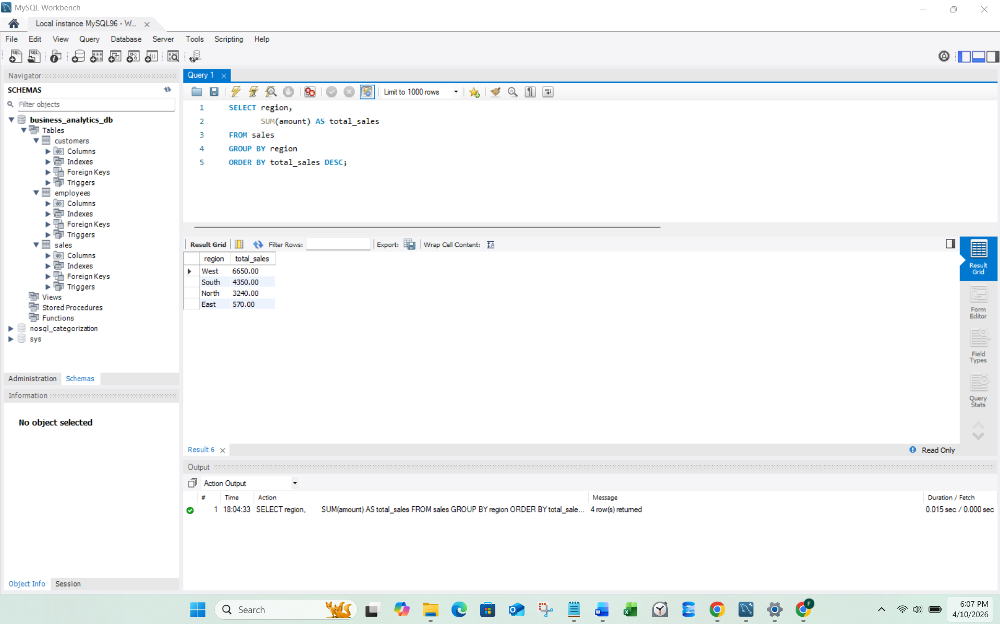

---

- **Query Results (Employee Ranking)** → This shows employee performance rankings.
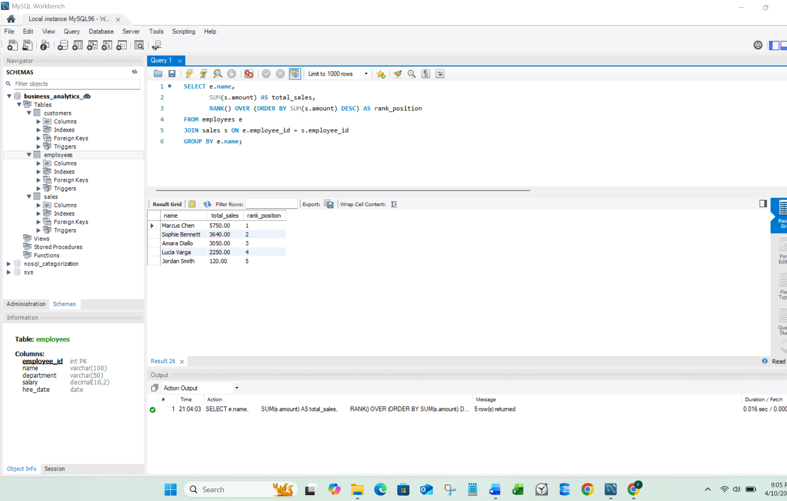

---

- **Query Results (Department Analysis)** → This shows top performing departments in descending order.
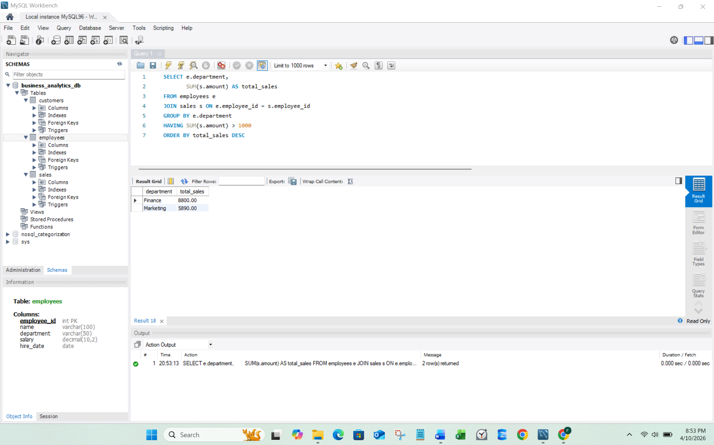

---

- **Query Results (Highest Performing Analysis)** → This shows top perfoming employees in descending order.
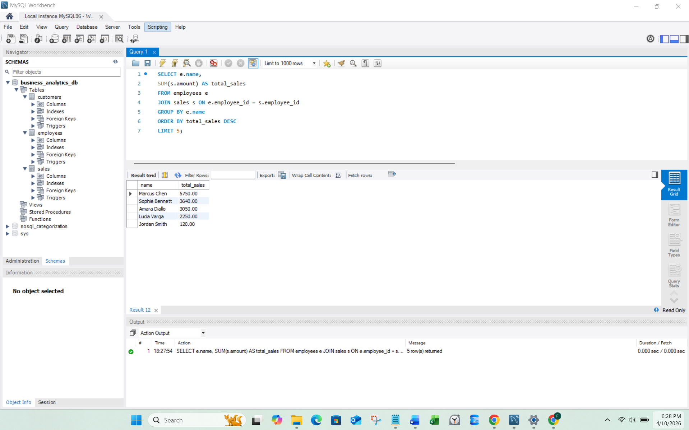

---

## Project Purpose
This project was created to demonstrate practical SQL skills for data analyst and data engineering roles, focusing on business intelligence, reporting, and data-driven decision-making.

---

# 📊 Project 3: Customer Revenue Analysis

---

## 📌 Overview
This project uses **MySQL** to analyze customer revenue data and identify key business insights such as top customers, total sales performance, and spending patterns.

The database is structured using relational tables, and SQL queries are used to extract meaningful insights from raw transactional data.

---

## 🎯 Objective
The main objectives of this project are:

- Analyze customer revenue using SQL queries
- Identify top customers based on total spending
- Evaluate total sales performance
- Group and segment customers by location and revenue
- Practice real-world MySQL data analysis techniques

---

## 🛠️ Tools Used

- SQL
- MySQL

---

## Dataset Structure

This project uses the existing database created in Project 1, which includes:

### Customers Table
- customer_id (Primary Key)
- name
- city
- singup_date

### Employees Table 
- employee_id (Primary Key)
- name
- department
- salary
- hire_date

### Sales Table
- sale_id
- employee_id (Foreign Key)
- amount
- sale_date
- region

---

## Files in This Project

- [`01_customer_concentration_by_city.sql`](project_3_customer_analysis/01_customer_concetration_by_city.sql) → Customers geographic concentration  
- [`02_regional_customer_revenue.sql`](project_3_customer_analysis/02_regional_customer_revenue.sql) → Regions generating the most revenue  
- [`03_employees_driving_customer_revenue`](project_3_customer_analysis/03_employees_driving_customer_revenue.sql) → Revenue tied to customer transactions  
- [`04_high_vs_low_engagement_by_city.sql`](project_3_customer_analysis/04_high_vs_low_engagement_by_city.sql) → Identifies top 5 highest-performing employees 

---

## 📈 Key Insights

- A small group of customers generates most of the revenue
- Certain cities have significantly higher customer activity
- Total revenue can be effectively segmented using SQL grouping
- Business performance can be measured using simple aggregation queries
- MySQL queries reveal patterns in customer spending behavior

---

## 📸 Screenshots

- **Customer Distribution by City** → Counts the total number of customers in each city and orders them from highest to lowest to identify where the most customers are located.

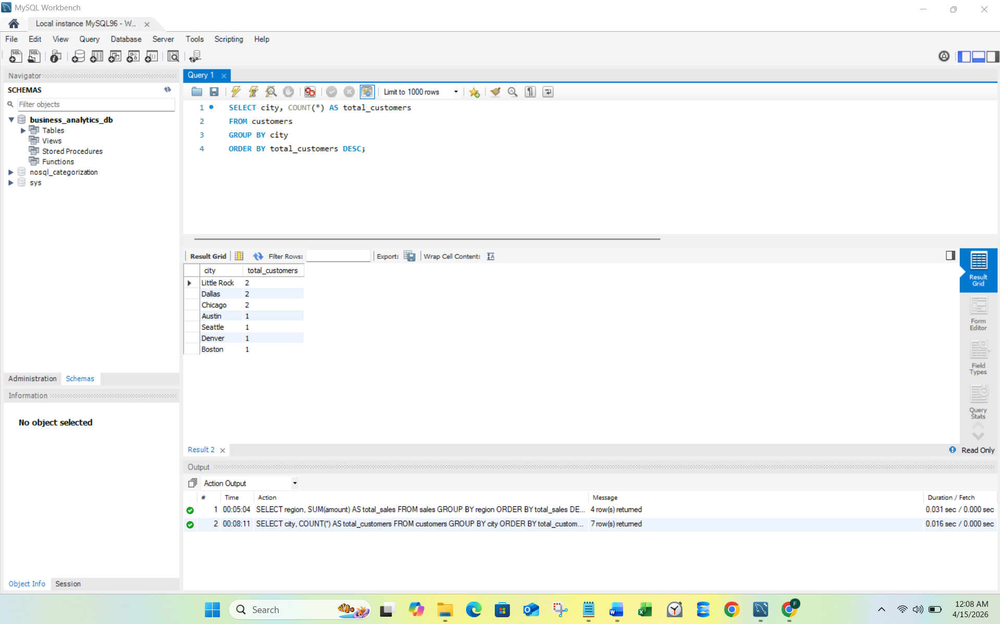

- **Total Sales by Region** → Calculates the total sales amount for each region and ranks them from highest to lowest to identify top-performing regions.

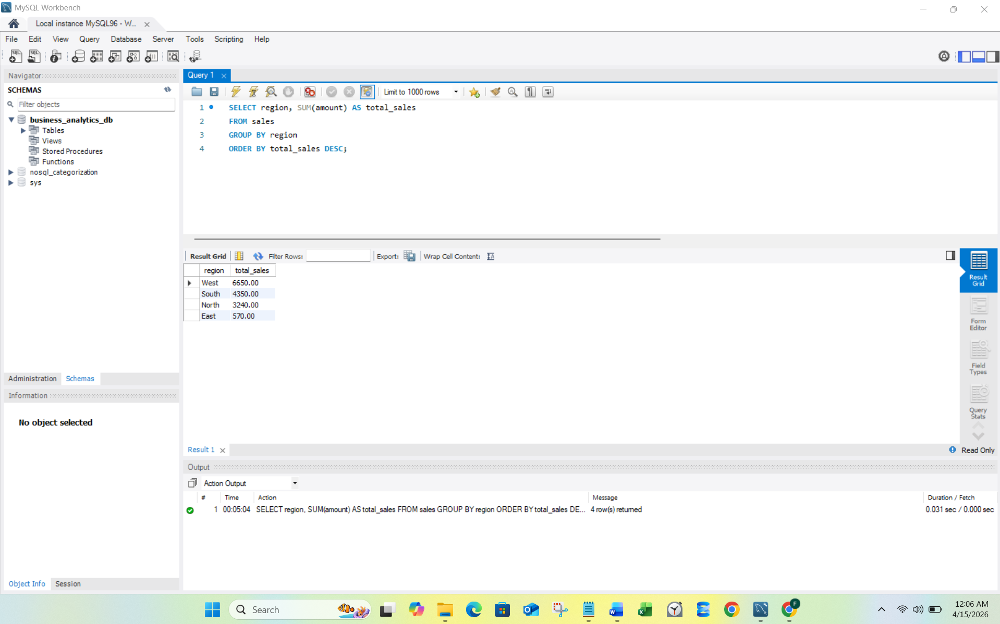

- **Employee Revenue Performance** → Calculates each employee’s total number of sales and total revenue generated, ranking them by highest revenue to evaluate performance.

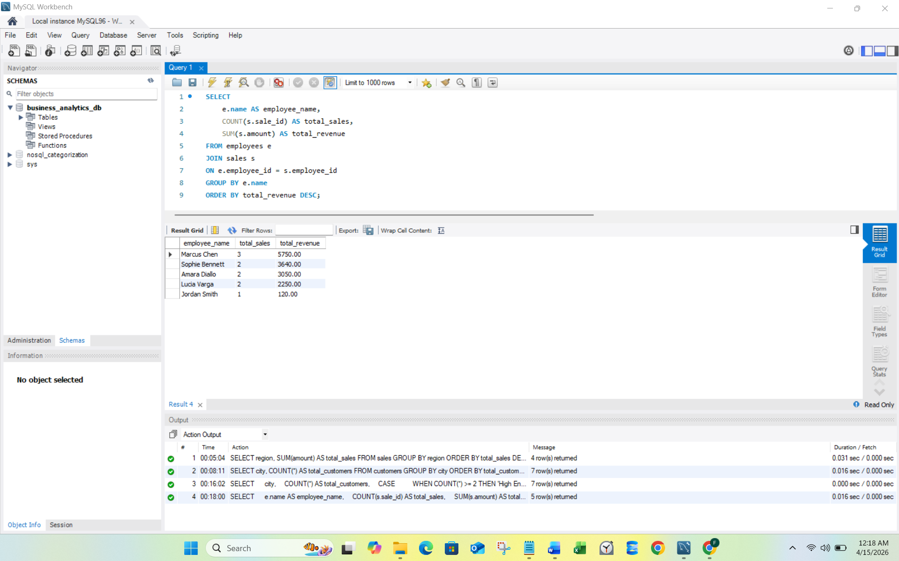

- **Customer Engagement by City** → Counts customers per city and categorizes each city as high or low engagement based on customer volume.

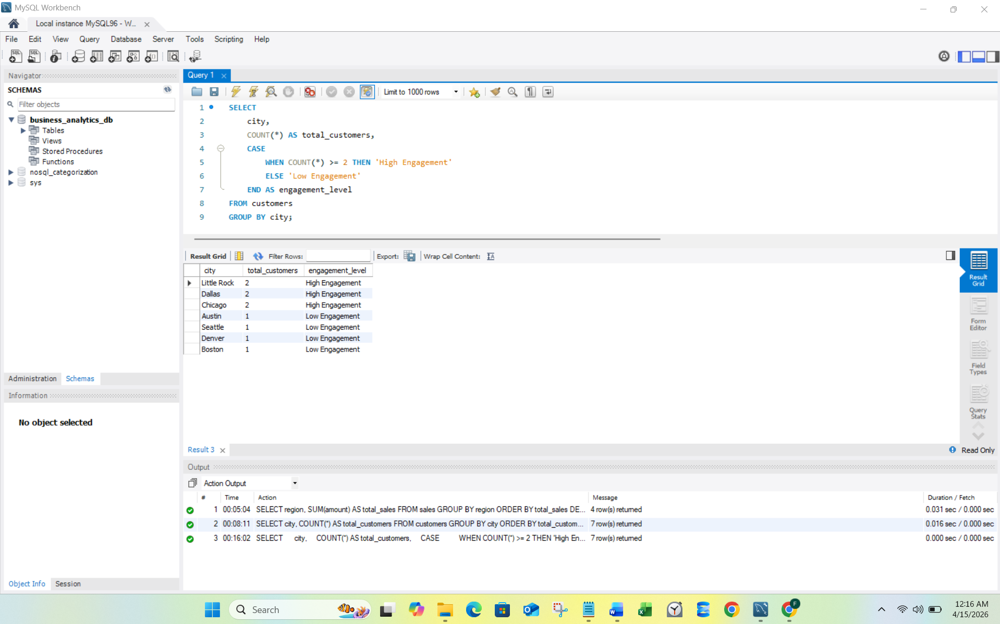

---

## Project Purpose
This project aims to analyze customer distribution, sales performance, and regional revenue trends to uncover key business insights. It helps identify high-performing regions and employees while also evaluating customer engagement levels across different cities to support data-driven decision-making.

